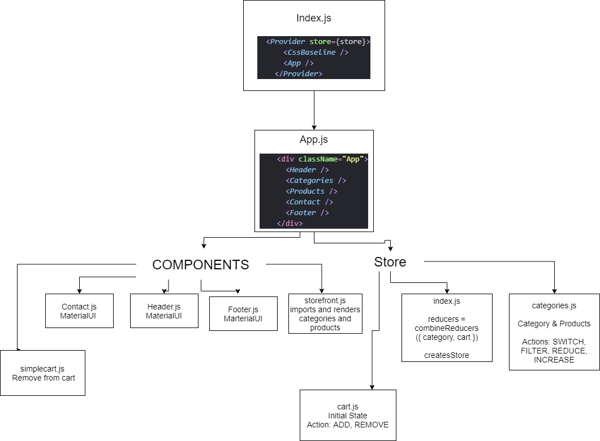

# StoreFront

## Author: Stacy Burris

### Collaborators

+ Tina Myers, Sara Strasner, Simon Panek

### Links

+ [GitHub PR](https://github.com/stacyburris/storefront/pull/3)
+ [StoreFrint Repo](https://github.com/stacyburris/storefront)
+ [Codesandbox](https://codesandbox.io/s/store-front-xmv7u)

### Challenge Day 1

+ Virtual Store Phase 1: Creating an e-Commerce storefront using React with Redux, coupled with your live API server
+ React app
+ MaterialUI

### Lab: Redux - Combined Reducers

+ Virtual Store Phase 2: Continue work on the e-Commerce storefront, breaking up the store into multiple reducers and sharing functionality/data between components

### Deploy to CodeSandbox

When provided, open Code Sandbox and Create a new application. When prompted, choose “From GitHub” and then paste in the URL to the current lab starter code folder from your fork of the class repository.

### UML

+ 
+ 

